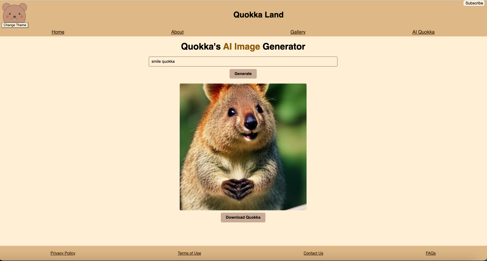

#  React Web Application with AI-Driven Image Generation from Text Input

## Purpose

This project is a React-based web application that offers a full suite of web components.
This application is integrated with a state-of-the-art Stable Diffusion Model to enable AI-driven image generation from user-defined keywords or phrases. The Stable Diffusion Model is wrapped into a Docker image and deployed as an AWS Lambda function to work as the backend. It is available through an AWS REST API endpoint. 

## User interface:

